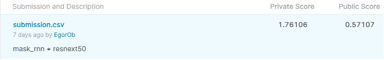

# MADE-DS-22-cv2
Для 2 ДЗ

Учил на колабе.

Основа бейзлайн.

### Детектор

  *Работа с данными:
    Проведена аугментация данных (измение размера, повороты, зашумление)
  *Изменение архитектуры:
    resnet18, resnet34, resnet50, resnext50, maskrcnn_resnet50.
    Остановился на maskrcnn_resnet50.
    
### Распознаватель:

*Работа с данными:
    Проведена аугментация данных (измение размера, повороты, зашумление)
    Использован дополнительный датасет (у меня прироста не дал)
*Изменение архитектуры:
    resnet18, resnet34, resnet50, resnext50
    Остановился на resnext50.
При ручном осмотре предсказаний детектора на maskrcnn_resnet50, показало приемлимую точность, 2% неверного распознования области номеров(выводило bbox небольшого размера вблизи номера), и приблизительно 7%, что не найдет bbox на ближайшем видимом авто.
Под конец соревнования упор был поставлен на распознователь, но видимо неправильно воспользовался дополнительным датасетом, поэтому произошло падение.

Для интереса были вручную размечены 600 фото (примерно 19%), и заменены эти данные в submission от лучшего на тот момент решения (0.77 на паблике), на удивление скор упал до 0.825 на паблике, 4.457 на привате. Непонятно почему добавление почти 20 процентов вероятнее правильных(не все символы номера были четко различимы) ответов ухудшило скор.
